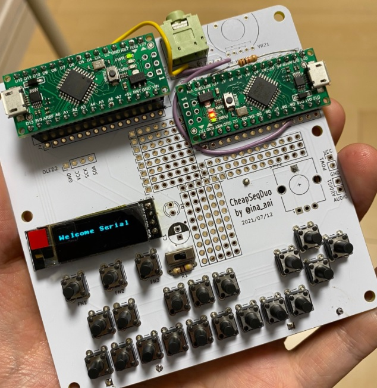

# これはなに？

勢いで作った基板です。

CheapSeqDuo

- Arduino Nanoを2つ搭載し
- ピアノ風のキーボード
- OLED(128x64または128x32）
- 単4電池x4本
- オーディオジャック
- ボリューム
- 10cm x 10cm

1つのArduinoをコントローラに、もう一つのArduinoを音源用に、と思い配置しています。

# TODO

- ファームウェアがまだない（一応自分の作った物を近いうちに公開しますが、大したものではないのでそれぞれ作るのが良いと思います）
- BOMがない

# 既知のバグ

- 2つのArduinoのTX,RXが直結されているので、2つ基板に配置するとArduinoとして書き込みできない（致命的）
  - パターンカットしてスイッチでTX,RXを繋げるようにするのがよさそう
- D13にLEDがついている関係でキースキャンがうまくできない、プルアップ抵抗を入れる事で回避できる
- (仕様) オーディオジャック、ボリュームのフットプリントはあるが未接続です。自分で手配線してArduinoと接続したり、オーディオアンプを構成したりしてください。

# 感謝

この基板はALLPCBのキャンペーンで無料で基板が作れるという事で作り始めたものです。

下記リンクからALLPCBを初めて利用すると、$30のクーポンがもらえますのでどうぞ。

[クーポン付きALLPCB入会URL](https://www.allpcb.com/?Mb_InviteId=77225)

(2021年7月現在 ALLPCBは「毎月送料含め基板無料キャンペーン」をやっているようで、この基板であれば5枚が無料で作れます。

# ライセンス

CC SA-BY とします。

（面白いボードができたら http://twitter.com/ina_ani まで教えてください。余ったら1枚ください！動くものが出来た場合はどこかで遊ばせてほしいです！）
